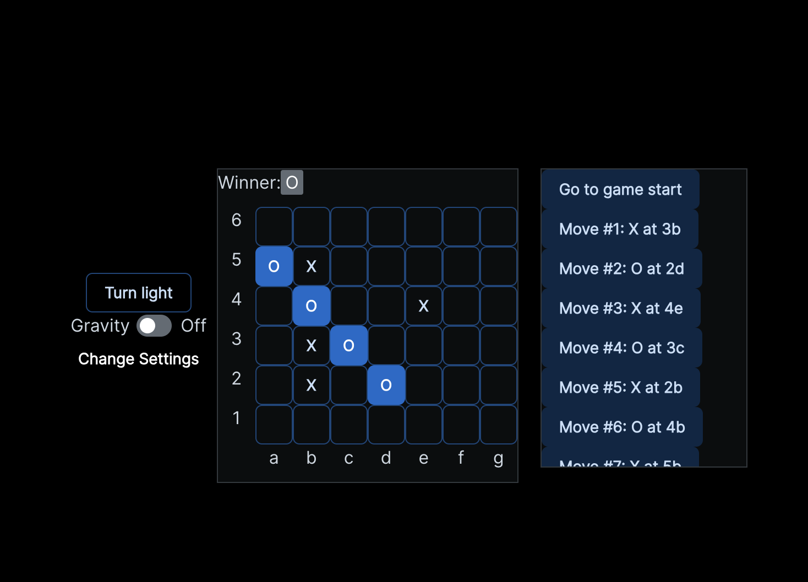

# CONNECT MORE

Connect more is a fully playable andcustomizable [m,n,k](https://en.wikipedia.org/wiki/M,n,k-game). The user is able to set their desired grid size, winning number of pieces, and whether the game is played bottom up, like Connect 4, or freely, like Tic-Tac-Toe. Have fun playing around with it [here](https://connectmore.netlify.app/).

## How It's Made

**Tech used:** HTML, CSS, JavaScript, React, [JoyUi](https://mui.com/joy-ui/getting-started/)

This project was built with [Create React App](https://github.com/facebookincubator/create-react-app) based on the [React Tic Tac Toe tutorial](https://react.dev/learn/tutorial-tic-tac-toe).

Once I decided to offshoot the tutorial with my own application, I implemented JoyUI to allow me to keep all the focus on learning React, without having to worry about how boring all my components looked.

In order to acheive the high level of custimazability wihtin the rules and board I needed to completely restructure the data. By making each square a button object, I was able to create a factory function that could be called successively regardless of the selected board size. I also created an object class to represent each board state with vairous attributes such as isGravityDrop or isWinning, which allowed me to track the moves of each game.

The calculateWinner function had to be completely refactored in order to be robust enough to handle any winning streak number efficiently. I achieved this by creating helper

## Future Imporvements
All improvements would be made with further modularity at the forefront of the mind.
- Add settingsState instances that can be cached in the browser to allow easy replay of various board set ups.
- Have DarkModeToggle's default set to the user's browser's default (I know this easy, I jsut haven't gotten around to it).
- Extracting the data layer from the ui layer.
- The most intensive (and most exciting) point of improvement would be to allow players to acces and play other players over wifi. Accomplishing this would require almost all off the above, as well as:
    - User accounts.
    - Allow for GamePlay instances that can be created by users and joined by other users.
    - Togglable sidebar that can display joinable games andd online players.
    - Store user profile, and game history data in a sql database
    - Implement APIs to connect with database
    - Create a much stronger separation between frontend and backend 

## Dependencies, Installation, Developer's Guide

The setup requires nothing special, so long as you are in a clean environment. In your terminal (if you use yarn or pnpm for package management replace `npm` with your repsective package manager in the instructions below):
1. Navigate to the directory in which you want to place the repo.
2. Run `git clone https://github.com/IHOPstack/ConnectX.git`.
3. Run `npm install` to install the dependencies from package.json
4. Run `npm start` to boot up the application in a localhost.